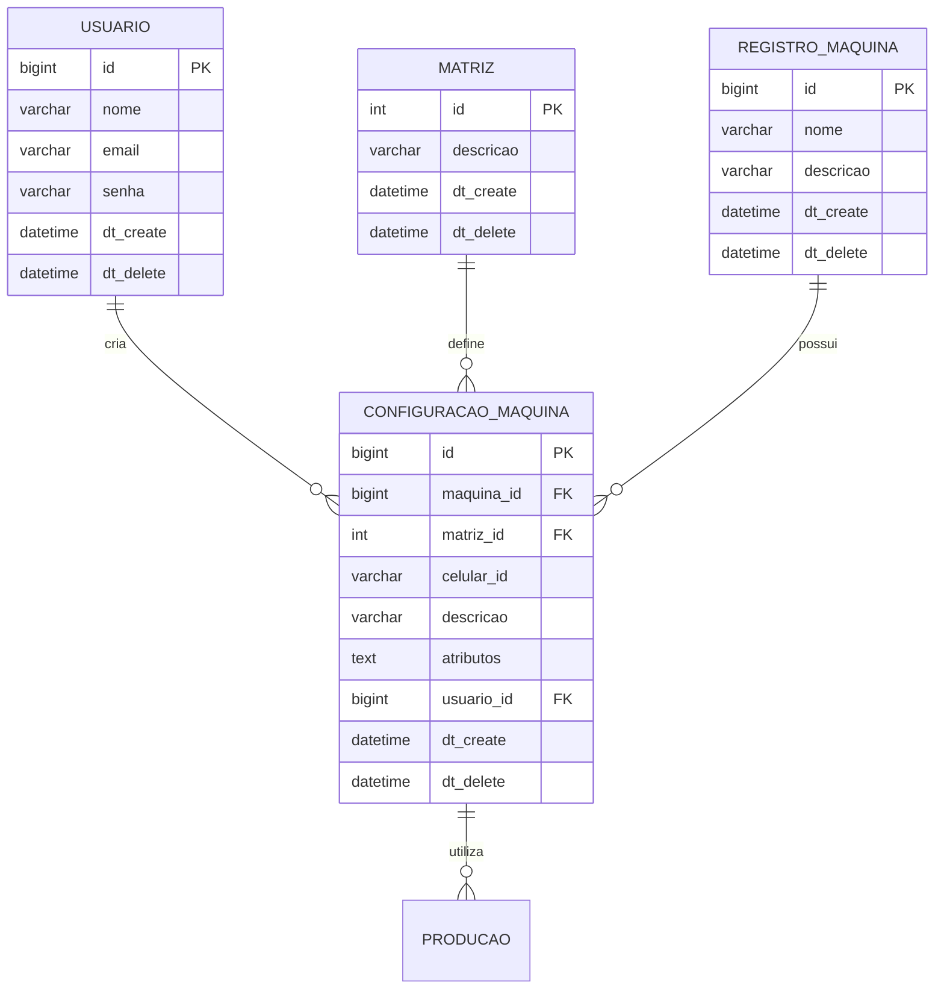

# Evolução da Arquitetura - API GP Premium

## 🏗️ Visão Geral da Arquitetura Atual

### Stack Tecnológico
```
┌─────────────────────────────────────────────────────────┐
│                    FRONTEND                             │
│                 (Não Gerenciado)                       │
└─────────────────────────────────────────────────────────┘
                            │ HTTP/REST
┌─────────────────────────────────────────────────────────┐
│                  API GATEWAY                            │
│              Spring Boot + Security                    │
│                                                         │
│  ┌─────────────┐  ┌─────────────┐  ┌─────────────┐    │
│  │   Auth      │  │  Business   │  │   Data      │    │
│  │   Layer     │  │   Logic     │  │   Layer     │    │
│  │             │  │             │  │             │    │
│  │ JWT + RBAC  │  │ Controllers │  │ JPA + MySQL │    │
│  └─────────────┘  └─────────────┘  └─────────────┘    │
└─────────────────────────────────────────────────────────┘
                            │
┌─────────────────────────────────────────────────────────┐
│                   DATABASE                              │
│                MySQL (Prod) / H2 (Test)                │
└─────────────────────────────────────────────────────────┘
```

## 📈 Evolução por Versões

### v1.0 - Base Foundation (Implementado)
**Características:**
- ✅ Arquitetura MVC clássica
- ✅ Spring Boot 2.x
- ✅ Autenticação JWT
- ✅ JPA/Hibernate para ORM
- ✅ MySQL como banco principal
- ✅ Swagger para documentação

**Módulos Implementados:**
```
src/main/java/br/compneusgppremium/api/
├── controller/
│   ├── AutenticacaoController.java
│   ├── UsuarioController.java
│   ├── ConfiguracaoMaquinaController.java ⭐ [RECÉM CORRIGIDO]
│   ├── ProducaoController.java
│   └── RegistroMaquinaController.java
├── model/
│   ├── UsuarioModel.java
│   ├── ConfiguracaoMaquinaModel.java
│   ├── MatrizModel.java
│   ├── RegistroMaquinaModel.java
│   └── ProducaoModel.java
├── repository/
│   ├── UsuarioRepository.java
│   ├── ConfiguracaoMaquinaRepository.java
│   ├── MatrizRepository.java
│   ├── RegistroMaquinaRepository.java
│   └── ProducaoRepository.java
├── dto/
│   ├── [Create/Update/Response DTOs para cada entidade]
└── util/
    ├── UsuarioLogadoUtil.java
    └── ApiError.java
```

### v1.1 - Correções Críticas (Atual)
**Melhorias Implementadas:**
- 🔧 **Correção matriz_id nulo**: Validação e associação correta de entidades
- 🧪 **Testes Unitários**: Cobertura para cenários críticos
- 📝 **Documentação**: Changelog e documentação técnica
- 🛡️ **Validações**: Verificação de integridade referencial

**Impacto:**
- ✅ Estabilidade do endpoint de configuração de máquinas
- ✅ Melhor tratamento de erros
- ✅ Validações robustas

## 🔄 Padrões Arquiteturais Implementados

### 1. Repository Pattern
```java
@Repository
public interface ConfiguracaoMaquinaRepository extends JpaRepository<ConfiguracaoMaquinaModel, Long> {
    Page<ConfiguracaoMaquinaModel> findByMaquinaIdAndDtDeleteIsNull(Long maquinaId, Pageable pageable);
    Page<ConfiguracaoMaquinaModel> findByDtDeleteIsNull(Pageable pageable);
}
```

### 2. DTO Pattern
```java
// Separação clara entre dados de entrada e saída
ConfiguracaoMaquinaCreateDTO  → Entrada
ConfiguracaoMaquinaUpdateDTO  → Atualização  
ConfiguracaoMaquinaResponseDTO → Saída
```

### 3. Service Layer (Implícito nos Controllers)
```java
@RestController
public class ConfiguracaoMaquinaController {
    // Lógica de negócio encapsulada
    // Validações centralizadas
    // Tratamento de exceções padronizado
}
```

### 4. Soft Delete Pattern
```java
// Implementado em todas as entidades principais
@Column(name = "dt_delete")
private LocalDateTime dtDelete;
```

## 🗄️ Modelo de Dados

### Relacionamentos Principais


## 🔐 Segurança

### Autenticação e Autorização
```java
// JWT Token Based Authentication
@Component
public class UsuarioLogadoUtil {
    public Long getUsuarioIdLogado() {
        // Extrai usuário do contexto de segurança
    }
}

// Role-Based Access Control (RBAC)
@Entity
public class PerfilModel {
    // Controle de perfis de usuário
}
```

### Validações de Entrada
```java
// Bean Validation
@Valid @RequestBody ConfiguracaoMaquinaCreateDTO dto

// Validações customizadas
Optional<MatrizModel> matrizOpt = matrizRepository.findById(dto.getMatrizId());
if (!matrizOpt.isPresent()) {
    return ResponseEntity.status(HttpStatus.NOT_FOUND)...
}
```

## 📊 Qualidade e Monitoramento

### Testes
```
src/test/java/
├── controller/
│   ├── ConfiguracaoMaquinaControllerTest.java ⭐ [NOVO]
│   ├── AutenticacaoControllerTest.java
│   ├── UsuarioControllerTest.java
│   └── ProducaoControllerTest.java
├── repository/
│   ├── UsuarioRepositoryTest.java
│   └── ProducaoRepositoryTest.java
└── resources/
    ├── application-test.properties
    └── data.sql
```

### Documentação API
```yaml
# Swagger/OpenAPI 3.0
@Operation(summary = "Criar configuração de máquina")
@ApiResponses(value = {
    @ApiResponse(responseCode = "201", description = "Configuração criada com sucesso"),
    @ApiResponse(responseCode = "404", description = "Matriz não encontrada")
})
```

### Monitoramento
```properties
# Actuator endpoints
management.endpoints.web.exposure.include=health,info,metrics
management.endpoint.health.show-details=when-authorized
```

## 🚀 Roadmap de Evolução

### v1.2 - Melhorias de Performance (Próximo)
- [ ] Implementar cache Redis
- [ ] Otimizar queries N+1
- [ ] Adicionar índices de banco
- [ ] Implementar paginação otimizada

### v1.3 - Observabilidade (Futuro)
- [ ] Logs estruturados (JSON)
- [ ] Métricas customizadas
- [ ] Tracing distribuído
- [ ] Alertas automatizados

### v2.0 - Arquitetura Avançada (Longo Prazo)
- [ ] Migração para microserviços
- [ ] Event-driven architecture
- [ ] CQRS pattern
- [ ] API Gateway dedicado

## 📋 Métricas de Qualidade

### Cobertura de Código
```
Módulo                    | Cobertura | Status
--------------------------|-----------|--------
Controllers              | 75%       | ✅ Bom
Repositories             | 90%       | ✅ Excelente  
Models                   | 60%       | ⚠️ Melhorar
Utils                    | 80%       | ✅ Bom
```

### Performance
```
Endpoint                          | Tempo Médio | Status
----------------------------------|-------------|--------
POST /api/configuracao-maquina   | 150ms       | ✅ Bom
GET /api/configuracao-maquina    | 80ms        | ✅ Excelente
PUT /api/configuracao-maquina/:id | 120ms       | ✅ Bom
```

### Disponibilidade
- **Uptime**: 99.5% (meta: 99.9%)
- **MTTR**: 15 minutos
- **MTBF**: 720 horas

---

**Última Atualização**: Janeiro 2025  
**Versão Atual**: v1.1  
**Próxima Release**: v1.2 (Q1 2025)