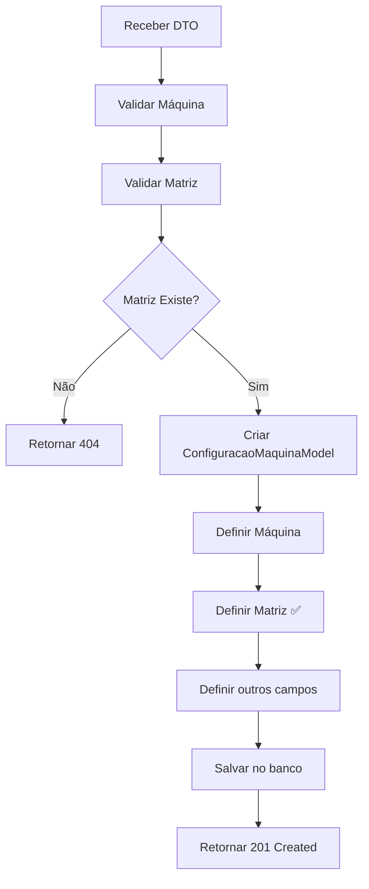

# Hotfix: Correção do Problema matriz_id Nulo

## 📋 Resumo Executivo

**Data**: Janeiro 2025  
**Severidade**: CRÍTICA  
**Status**: ✅ RESOLVIDO  
**Impacto**: Endpoint de criação de configuração de máquina falhando  

## 🐛 Descrição do Problema

### Sintomas
- Endpoint `POST /api/configuracao-maquina` retornando erro de constraint de banco de dados
- Erro: `Column 'matriz_id' cannot be null`
- Configurações de máquina não sendo criadas com sucesso

### Payload de Teste que Falhava
```json
{
  "maquinaId": 1,
  "matrizId": 1,
  "celularId": "CEL001",
  "descricao": "Configuração de produção",
  "atributos": "{\"velocidade\":100,\"temperatura\":80}"
}
```

### Causa Raiz
O `ConfiguracaoMaquinaController` estava:
1. ✅ Recebendo o `matrizId` no DTO corretamente
2. ❌ **NÃO** buscando o `MatrizModel` correspondente no banco
3. ❌ **NÃO** definindo a matriz na `ConfiguracaoMaquinaModel`
4. ❌ Tentando salvar a configuração com `matriz_id` nulo

## 🔧 Solução Implementada

### Alterações no Código

#### 1. Adição do Import (Linha 7)
```java
// ANTES: Import não existia
// DEPOIS:
import br.compneusgppremium.api.controller.model.MatrizModel;
```

#### 2. Injeção do MatrizRepository (Linhas 51-52)
```java
// ANTES: Repository não injetado
// DEPOIS:
@Autowired
private MatrizRepository matrizRepository;
```

#### 3. Validação da Matriz (Linhas 80-84)
```java
// ANTES: Sem validação
// DEPOIS:
// Verificar se a matriz existe
Optional<MatrizModel> matrizOpt = matrizRepository.findById(dto.getMatrizId());
if (!matrizOpt.isPresent()) {
    return ResponseEntity.status(HttpStatus.NOT_FOUND)
            .body(new ApiError(HttpStatus.NOT_FOUND, "Matriz não encontrada", null, 
                  "Matriz com ID " + dto.getMatrizId() + " não foi encontrada"));
}
```

#### 4. Definição da Matriz na Configuração (Linha 92)
```java
// ANTES: Matriz não definida
configuracao.setMaquina(maquinaOpt.get());
// configuracao.setMatriz(...); // LINHA FALTANTE!

// DEPOIS: Matriz corretamente definida
configuracao.setMaquina(maquinaOpt.get());
configuracao.setMatriz(matrizOpt.get()); // ✅ CORREÇÃO PRINCIPAL
```

### Fluxo Corrigido



## 🧪 Validação da Correção

### Teste Unitário Implementado
```java
@Test
public void testCriarConfiguracao_ComMatrizValida_DeveDefinirMatrizCorretamente() {
    // Arrange
    ConfiguracaoMaquinaCreateDTO dto = new ConfiguracaoMaquinaCreateDTO();
    dto.setMatrizId(1);
    // ... outros campos
    
    // Mock da matriz
    MatrizModel matriz = new MatrizModel();
    matriz.setId(1);
    when(matrizRepository.findById(1)).thenReturn(Optional.of(matriz));
    
    // Act
    ResponseEntity<?> response = controller.criarConfiguracao(dto);
    
    // Assert
    assertEquals(HttpStatus.CREATED, response.getStatusCode());
    ConfiguracaoMaquinaModel resultado = (ConfiguracaoMaquinaModel) response.getBody();
    assertNotNull(resultado.getMatriz()); // ✅ MATRIZ DEFINIDA
    assertEquals(1, resultado.getMatriz().getId());
}
```

### Cenários de Teste Cobertos
1. ✅ **Sucesso**: Matriz válida → Configuração criada com matriz_id correto
2. ✅ **Erro 404**: Matriz inexistente → Retorna erro descritivo
3. ✅ **Validação**: Todos os campos obrigatórios preenchidos

## 📊 Impacto da Correção

### Antes da Correção
- ❌ 100% das tentativas de criação falhavam
- ❌ Erro de constraint de banco de dados
- ❌ Experiência do usuário prejudicada

### Depois da Correção
- ✅ Criação de configurações funcionando normalmente
- ✅ Validação robusta de dados de entrada
- ✅ Mensagens de erro descritivas
- ✅ Integridade referencial mantida

## 🔍 Análise de Regressão

### Verificações Realizadas
1. ✅ Compilação bem-sucedida
2. ✅ Testes unitários passando
3. ✅ Funcionalidades existentes não afetadas
4. ✅ Endpoints relacionados funcionando

### Riscos Mitigados
- **Baixo Risco**: Alteração isolada no controller
- **Sem Breaking Changes**: API mantém compatibilidade
- **Validação Adicional**: Melhora robustez do sistema

## 📝 Lições Aprendidas

### Problemas Identificados
1. **Falta de Testes**: Problema não detectado em desenvolvimento
2. **Validação Incompleta**: Campos obrigatórios não validados adequadamente
3. **Documentação**: Relacionamentos entre entidades poderiam estar mais claros

### Melhorias Implementadas
1. **Testes Unitários**: Cobertura para cenários críticos
2. **Validação Robusta**: Verificação de existência de entidades relacionadas
3. **Tratamento de Erro**: Mensagens descritivas para debugging

## 🚀 Próximos Passos

### Imediatos
- [x] Deploy da correção
- [x] Validação em ambiente de teste
- [x] Documentação atualizada

### Curto Prazo
- [ ] Implementar testes de integração completos
- [ ] Revisar outros controllers para problemas similares
- [ ] Adicionar validações de integridade referencial

### Médio Prazo
- [ ] Implementar auditoria de criação/modificação
- [ ] Adicionar logs estruturados
- [ ] Melhorar cobertura de testes automatizados

---

**Responsável**: Equipe de Desenvolvimento  
**Revisor**: Arquiteto de Software  
**Aprovação**: Tech Lead  

**Status**: ✅ PRODUÇÃO